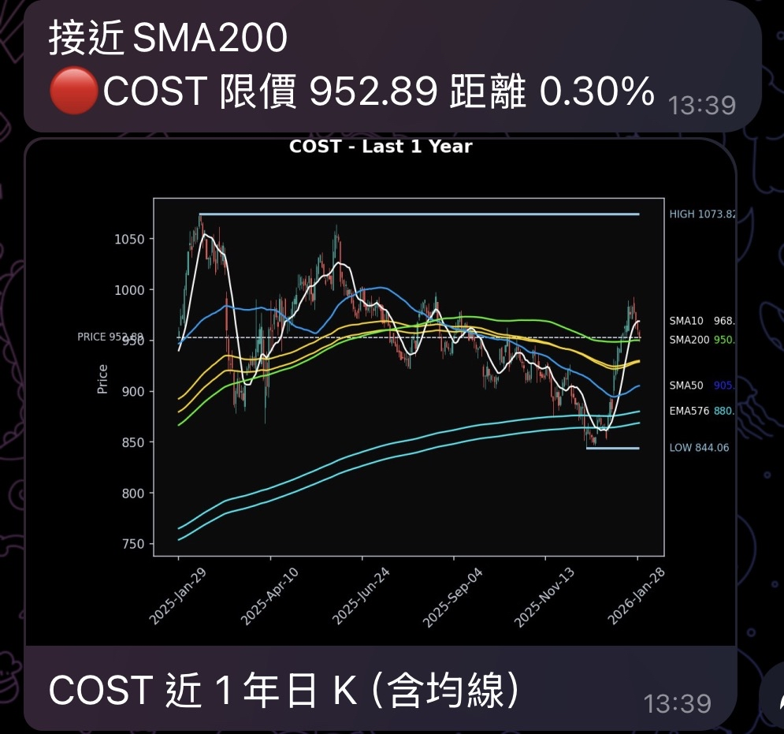

# Stock Alert Telegram Bot

這個程式會自動追蹤你設定的股票，當股價接近重要均線（EMA或SMA）時，透過 Telegram 發送通知

---

#### 實際顯示畫面



---


## 功能

* 自動抓取股票歷史價格（使用 yfinance）
* 計算技術指標：
  * EMA（長期與中期，可自訂週期）
  * SMA50、SMA200
* 判斷股價是否接近均線（可設定百分比範圍）
* Telegram 即時通知
* 用 emoji 標示趨勢：

  * 🟢 牛市（SMA50 > SMA200）
  * 🔴 熊市（SMA50 < SMA200）

---

## 策略邏輯

* 當價格在重要均線附近時，可考慮執行看漲
  * EMA576 為 Vegas Channel 的上緣（註：EMA676為下緣）
  * EMA169 為短期 Vegas Channel 的下緣 （註：EMA144為上緣）
* 當價格為機構定義的熊市時可考量布局
  * 機構定義的熊市：均線死叉（SMA50 < SMA200）

*可在本邏輯的基礎上，加入各自的進場邏輯*

---

## 安裝

1. 安裝 Python 3.8+
2. 安裝必要套件：

```bash
pip install yfinance pandas requests
```

---

## 設定

1. **Telegram Bot**

   * 用 [BotFather](https://t.me/botfather) 建立 Bot，取得 `BOT_TOKEN`
   * 找到你的 `CHAT_ID`（可用 `@userinfobot` 或寫程式測試）

2. **環境變數（或直接將TOKEN 跟 CHAT_ID 置於程式碼也可以）**

```bash
export TELEGRAM_BOT_TOKEN="YOUR_BOT_TOKEN"
export CHAT_ID="YOUR_CHAT_ID"
```

3. **修改程式變數（股票與參數）**

```python
STOCK_LIST = ["AAPL", "AMZN", "MSFT"]  # 追蹤的股票
NEAR_PERCENT = 0.01  # 股價接近均線 ±1% 觸發通知
EMA_LONG = 576        # 長期 EMA（可自訂）
EMA_MEDIUM = 169      # 中期 EMA（可自訂）
```

---

## 使用方式

直接在命令列執行：
* 建議在每天美股收盤時自動執行一次 (搭配定時任務)
* 我個人在每天早上8:00(UTC+8)執行
```bash
python stock_detector.py
```

程式會：

1. 抓取股票過去 3 年每日價格
2. 計算技術指標
3. 判斷股價是否接近均線
4. 發送 Telegram 訊息

---

## Telegram 訊息範例

```
接近EMA576
🟢AAPL 限價 172.50 距離 0.85%
🔴AMZN 限價 103.20 距離 -0.92%

接近SMA200
🟢MSFT 限價 305.40 距離 0.50%
```


---


